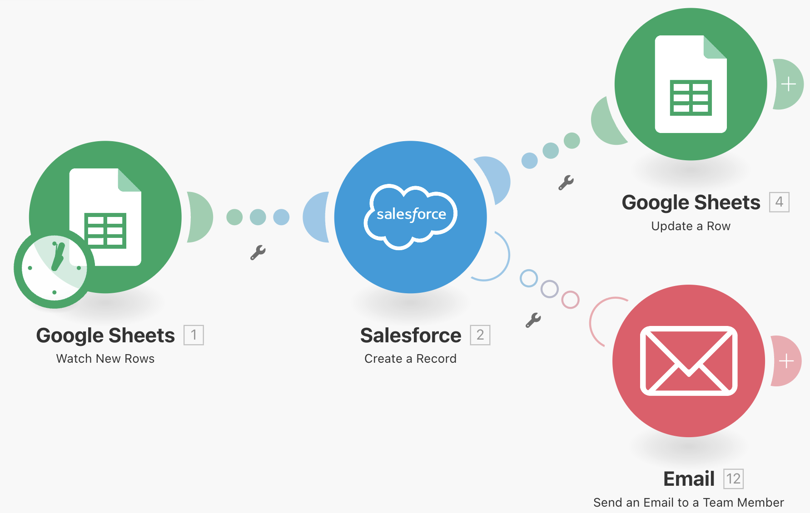
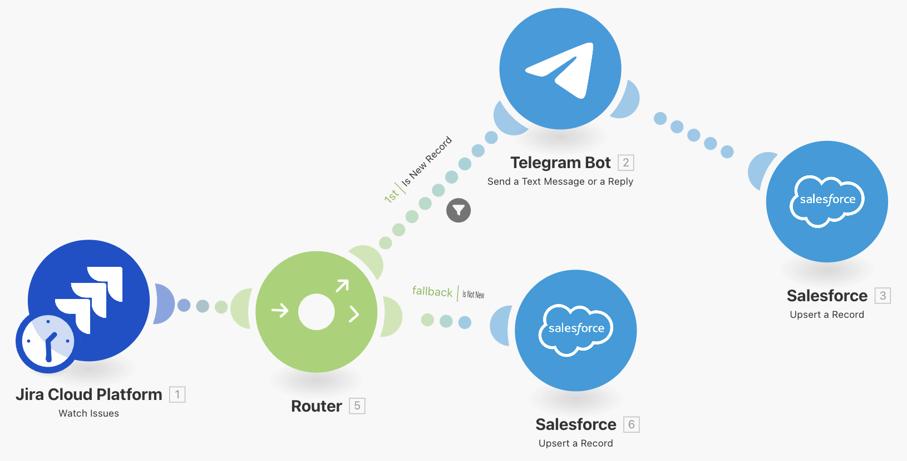
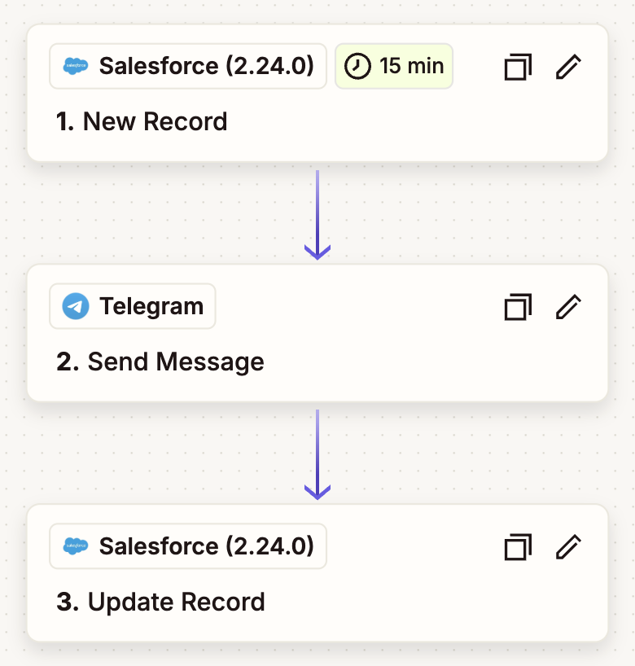
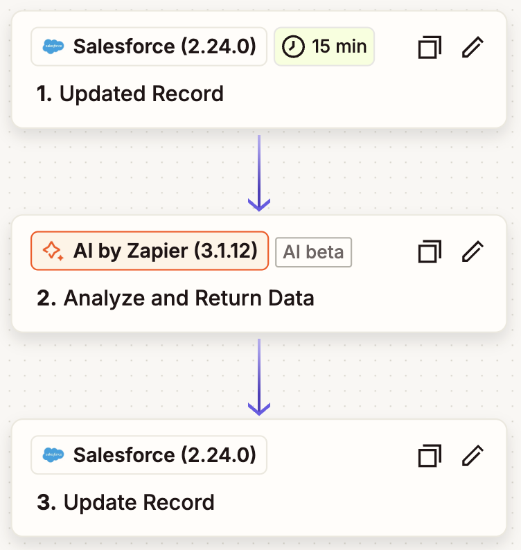

# 👋 Hi! I'm Maksim — Salesforce & Automation Developer

I build smart systems, integrations and automations that save businesses time and money.

[📩 Contact](mailto:m.palynov@gmail.com) · 
[⬇️ Download Resume](https://drive.google.com/file/d/1bIMxqd63o44Tv9qjk7c1dwO4plWhr-M3/view?usp=sharing) · 
[💼 LinkedIn](https://linkedin.com/in/maksim-palynov)

---

## 🧑‍💻 About Me

- 4 years of commercial development experience:
    * 1 year as wed developer
    * 3 years as Salesforce developer
- Expertise: Salesforce, Make.com, Zapier, Mulesoft, JS/TS, C#, FormAssembly
- Develop custom scenarios and integrations to streamline business processes  
- Work remotely and take on freelance projects  

**Tech stack:** 
- Salesforce (Apex, LWC, VF, Aura, Declarative features),
- Make.com, Zapier, MuleSoft,
- REST & SOAP API,
- JavaScript/TypeScript,
- React,
- Angular,
- ASP.Net,
- Node.js

---

## 🚀 Latest projects

### 📌 Multi-Org Salesforce Project Support & Development (Education Domain)

**Description:**  
Provided ongoing **support, bug fixing and feature development** for a large-scale Salesforce project in the **education sector**, managing **15+ production orgs simultaneously**.  
The work included integration of **AppExchange packages** (Vonage, Duplicate Checker, NativeVideo) and deep platform optimization.  

Key responsibilities covered:  
- Migrating and optimizing workflows and processes from **Process Builder to Flow**  
- Refactoring legacy **Apex** code and performing static code analysis  
- Developing new functionality with **Apex, Flows, LWC, Visualforce, and Declarative Features**  
- Setting up chats, **WhatsApp** integration, and SMS distribution with **Twilio**  
- Platform administration: creating objects, fields, security settings, dashboards, and reports  
- Documenting all implemented features and changes for knowledge transfer and long-term support

**Key Technologies:** Salesforce · Apex · LWC · Visualforce · Flows · Declarative Features · AppExchange (Vonage, Duplicate Checker, NativeVideo) · Twilio · WhatsApp

**Key Features:**
- Simultaneous maintenance and development across 15 production orgs  
- Modernization of automation by replacing workflows with Flows  
- Integration of third-party communication and video packages from AppExchange  
- Legacy code refactoring and introduction of best practices in Apex and declarative tools  
- End-to-end platform customization, configuration, and administration  
- Comprehensive documentation for smooth handover and ongoing support
##

## 📌 Gas & Oil Logistics Dashboard

**Description:** 
A web application in the gas and oil logistics sector.  
The core functionality is an interactive dashboard pulling data from a database and generating charts and reports across various parameters and filters.  
The application is optimized for working with large data volumes, providing users with fast, real-time analytics and reporting.

**Role**  
Maintenance and bug fixing of the existing solution on both front-end and back-end.  
Focused on error resolution, performance improvements, and UX enhancements.

**Key Technologies:** C#, ASP.NET, Angular, NgRx, TypeScript, MS SQL

**Key Contributions**  
- Fixed bugs and optimized code in ASP.NET APIs and Angular components  
- Optimized database queries for improved performance  
- Resolved issues related to chart rendering and data filtering  
- Supported and enhanced UX/UI of the analytics dashboard  

**Results**  
- Increased application stability and responsiveness  
- Reduced data loading and visualization time  
- Improved user experience when working with the dashboard
##

### 📌 FormAssembly Forms Integrated with Salesforce

**Description:**  
Designed and implemented **custom web forms** in **FormAssembly** tightly integrated with **Salesforce**.  
These forms allowed to:
- Create new **Cases** and **Call requests** which will be associated with existing **Leads** and **Opportunities** (otherwise will be created new)
- Update **GDPR-related** information directly in Salesforce
- Integration wish customer sites to allow users fill the data directly on the site
  
This setup provided a more powerful and user-friendly alternative to standard Web-to-Case forms.

**Key Technologies:** FormAssembly · Salesforce

**Key Features:**
- Seamless creation and association of Cases with existing records
- GDPR data update workflows directly from the forms
- Advanced record operations (create, search, delete, link) via FormAssembly–Salesforce integration
- Enhanced flexibility and better user experience compared to standard Web-to-Case
##

### 📌 Google Forms to Salesforce Integration

**Description:**  
Built an automation pipeline where data submitted through **Google Forms** is stored in **Google Sheets**.  
Using **Make.com**, each new row in Google Sheets automatically creates a corresponding **Salesforce record**.  
After the record is created in Salesforce, the workflow updates the Google Sheets row with the **Salesforce Record ID** to keep both systems in sync.

**Key Technologies:** Google Forms · Google Sheets · Make.com · Salesforce

**Key Features:**
- Seamless integration between form submissions and Salesforce
- Automatic creation of Salesforce records from Google Sheets entries
- Bi-directional update: Google Sheets automatically receives the new Salesforce Record ID
##

### 📌 Jira → Salesforce & Telegram Sync Automation

**Description:**  
Implemented an integration where updates in **Jira tickets** automatically trigger a **Make.com** scenario.  
If the ticket is **new**, the workflow sends a notification to a **Telegram chat via a bot** and creates a corresponding **Salesforce record**. 
In case if the ticket **already exists**, the workflow updates the related Salesforce record, keeping the systems synchronized.

**Key Technologies:** Jira · Make.com · Telegram Bot API · Salesforce

**Key Features:**
- Notification to Telegram when a new Jira ticket is created
- Automatic Salesforce record creation for new tickets
- Seamless update of existing Salesforce records when Jira tickets change
- Reduced manual data entry and faster cross-system communication
##

### 📌 Salesforce → Telegram Bot Notifications (Zapier)

**Description:**  
Built an integration where creating a new **Salesforce record** automatically triggers a **Zapier** workflow.  
The workflow sends a notification through a **Telegram bot** to a specified chat and then updates the corresponding Salesforce record with a new **status** to reflect that the message was delivered.

**Key Technologies:** Salesforce · Zapier · Telegram Bot API

**Key Features:**
- Telegram notifications on new Salesforce records
- Automatic status update back in Salesforce after sending the message
- Reduced manual follow-up and improved team communication
##

### 📌 AI-Powered Lead Scoring for Salesforce (Zapier)

**Description:**  
Developed an integration where updates to **Salesforce Leads** automatically trigger a **Zapier** workflow that sends the lead data to **ChatGPT** for analysis.  
The AI evaluates the lead and returns:
- The **probability of converting** the lead into an opportunity
- The **key factors** influencing the decision
- **Recommended strategies** for handling the lead  

The returned insights are captured back in Salesforce, enriching the lead record with actionable intelligence.

**Key Technologies:** Salesforce · Zapier · OpenAI / ChatGPT API

**Key Features:**
- Automatic lead data transfer from Salesforce to ChatGPT on record updates
- AI-driven probability scoring and factor analysis
- Personalized recommendations for sales strategy stored directly in Salesforce
- Streamlined decision-making and improved conversion outcomes

---

## 🛠 Services

- 🔗 **Integrations & Automation**  
  - Building end-to-end workflows with Make.com, Zapier, MuleSoft
  - REST & SOAP API integrations, custom webhooks  
  - Synchronizing data between Salesforce and external systems

- ⚡ **Salesforce Development**  
  - Custom features development with Apex, LWC, Visualforce, Aura Components and Declarative Features  
  - Platform setup like custom objects, field, security settings and etc.
  - AppExchange packages deployment and setup for customer's application needs

- 💻 **Web Application Development**
  - Frontend development with React and Angular
  - Backend development with ASP.NET and Node.js  
  - Creating responsive dashboards and custom UI components

- 💡 **Consulting & Optimization**  
  - Process audit and optimization of existing automations  
  - Best-practice guidance for Salesforce and integration architectures  
  - Ongoing support and enhancements

---

## 📞 Contact

- 📧 Email: m.palynov@gmail.com  
- 💼 [LinkedIn](https://linkedin.com/in/maksim-palynov)  
- 📱 Telegram: @MaksonPLNV
- 🧑🏻‍💻 [GitHub](https://github.com/MaximPLNV)

---

© 2025 Maksim Palynov. Built with ❤️ on GitHub Pages.
